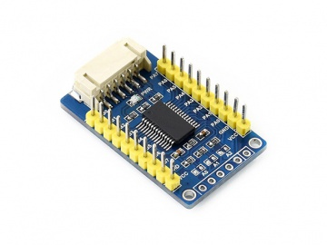

# raspi-mcp23017
> 简易封装 `MCP23017` I/O扩展模块的使用



## Usage
1. 接线：https://www.waveshare.net/wiki/MCP23017_IO_Expansion_Board
2. enable raspberry I2C
3. 安装 `raspi_mcp23017`

```Python
from raspi_mcp23017 import MCP23017

mcp = MCP23017(0x27)
mcp.A[0].setOutput() # 设置 A0 口为 OutPut
print(mcp.A[0].value)
mcp.A[0].value=1    # 设置 A0 口电压为高电平
print(mcp.A[0].value)
```


## Installation
> $ pip install git+https://github.com/Buzz2d0/raspi-mcp23017.git@master#egg=raspi_mcp23017